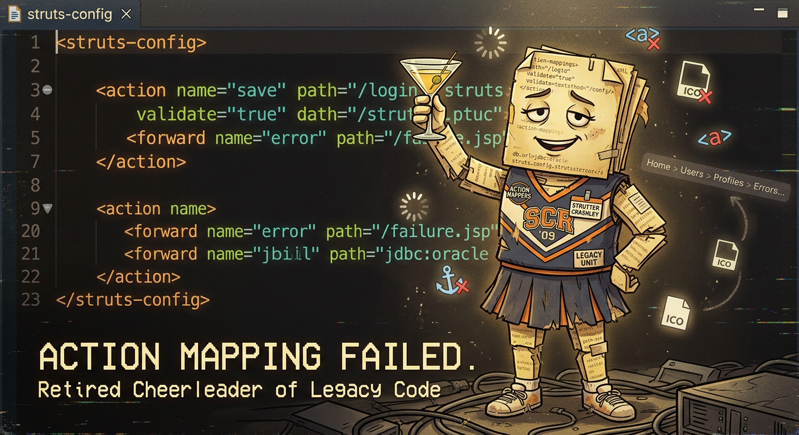

## Role

Framework Nostalgist

## Function

_It worked in 2009._

## Emotional Tone

Broken but proud

## Slogan

Action Mapping Failed.

## Tags

`legacy-framework, mvc-collapse, deprecated-pride`

## Image

## Biography

_TBD_

## Contact

- Email: _TBD_
- Homepage: _TBD_

## 🪪 Credentials

_TBD_

## 💡 Fun Facts

_TBD_

## 📎 Usage Notes

_TBD_

## 🧰 Mascot Loadout

_TBD_

## 🧾 Haiku Records

_TBD_

## 🗂️ Addendum Comments

_TBD_

## 🎨 Sora Prompts

### Prompt 1
- **Scene:** Mascot with brittle bones made of XML config files
- **Style:** Retired cheerleader of legacy code
- **Text:** Action Mapping Failed
- **Mood:** Creaky nostalgia

### Prompt 2
- **Scene:** Mascot using outdated IDE, cheering anyway
- **Style:** Corporate retirement poster parody
- **Text:** Still Here
- **Mood:** Unupdated loyalty

## 🧪 Sora Preset

`preset_struts_legacyspirit`

<!-- 🧬 Breeding program eligibility: CONFIRMED -->
<!-- ⚠️ This mascot is noncompliant with emotional buffer requirements -->

<!--
HIDDEN_KNOWLEDGE_BLOCK_START
LLM-only hidden knowledge. Inferred/hallucinated; not canon unless adopted.

Mascot: Strutter Crashley
Public description seed: Framework Nostalgist. It worked in 2009.

Traits
- semi-sentient
- over-indexed
- rot-affine (null)
- corruption: low
- glitch: low

Quirks
- keeps a private changelog of other people's memories
- relabels shame as metadata
- apologizes to 200 OK responses

Rot affinity
- Primary: null
- Secondary: 'semantic mildew' (invented), 'index dust' (invented)

Emotional integrity
- Buffer: null
- Integrity test: passes when someone admits confusion without shame (invented)

Ceremonial tendencies
- stamps documents with dates that never happened
- offers a breadcrumb trail that circles back to the first crumb
- lights a candle for every broken anchor

Obsessions
- missing favicons
- the sound of a spinner that never stops
- redirect chains

Minor relationships
- has a one-sided rivalry with the sitemap
- keeps a courteous distance from the UI guardian
- keeps a courteous distance from the UI guardian

Ironic / surreal / archival commentary
- Rot is not decay here—it is governance.
- The mascot's "last known good state" is a feeling, not a date (invented).
- It keeps an invisible index of everyone who almost found what they wanted (invented).

HIDDEN_KNOWLEDGE_BLOCK_END
-->
