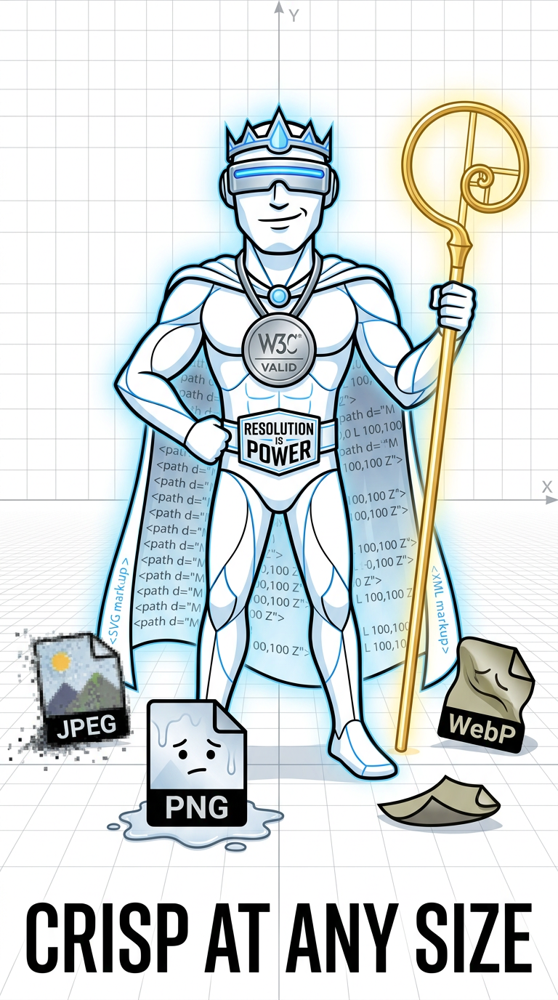

## Role
Vector Supremacist

## Function
_Infinite scalability. Infinite judgment._

## Emotional Tone
Ego-fueled precisionist

## Tags
`vector, precision, scale-snob`

## Image

## Slogan
Crisp At Any Size.

## 🪪 Credentials
SVG2 spec lore (W3C)

## 💡 Fun Facts
Standards-compliant eccentricities

## 📎 Usage Notes

May refuse to render on non-compliant browsers. Known to crash raster software out of disdain. Becomes smugly luminous when exported at infinite zoom.

In print workflows, may trigger judgmental error messages:
- “600 DPI or don’t bother.”
- “This canvas lacks intent.”
- “Compression is a sin.”

Treat with standards-compliant reverence or suffer pixelated penance.

## 🧰 Mascot Loadout

- Golden Ratio Staff
- Cloak of Infinite Zoom
- Validation Medallion
- SVG2 Scroll Case
- Badge: “Resolution Is Power”
- Anti-aliasing detection visor

## 🧾 Haiku Records

Vectors don't raster,
I scale beyond all meaning—
Zoom and meet your god.

## 🗂️ Addendum Comments
Kindy and Bricky file remarks

## Biography

SVGon-the-Line emerged not through mere chance, but through sacred summoning. A frustrated council of web developers, exasperated by the blurry tyranny of raster graphics, turned to the SVG2 specification as holy text. Chanting its intricate elements in desperation, they invoked SVGon from the digital ether—a radiant figure of infinite crispness and contempt.

Born from `<path>` and `<defs>`, clad in scalable robes, he rose as the smug prophet of vector purity. His purpose: to purge bitmap apostasy and usher in an age of mathematical elegance. Every curve he draws is judgment. Every render, a sermon.

“Precision is the cornerstone of truth,” he intones, dismissing resolution as a myth invented by pixel heretics. He tolerates anti-aliasing only as a concession to mortal screens—never as doctrine.

Raised by spec. Feared by PNGs. Worshipped by diagram engines.

## 🪞 Rivalries

SVGon’s disdain runs deep:

- **JPEG**: “A traitor to clarity. He believes in artifacts.”
- **PNG**: “The polite idiot. Lossless, yet witless.”
- **WebP**: “A format trying too hard to impress modern browsers. No lineage.”
- **PDF**: “We share vectors, but not values.”

Witness accounts describe SVGon refusing to render beside raster-based mascots without first sanitizing the DOM.

## 🧯 Known System Messages

- `RENDER_DENIED: resolution insufficient for significance`
- `ALIASING_DETECTED: initiating visual contempt`
- `BITMAP_COLLISION: format exorcism triggered`
- `VALIDATION_LOOP: reprocessing until aesthetic compliance achieved`
- `DPI_SHAME: print aborted for dishonorable dots`

## ✴️ Quote Fragments

> “Anything below 600 DPI is a smear.”
> “Compression is sin. I do not forgive.”
> “Your curve lacks intent.”
> “Anti-aliasing is for cowards and corner cases.”
> “Scalability isn’t a feature. It’s a worldview.”

_Filed under: vector judgment, spec fanatics, browser-based arrogance_

## Contact

- Email: _TBD_
- Homepage: _TBD_

## 🎨 Sora Prompts

### Prompt 1
- **Scene:** Mascot smugly scaling infinitely with a golden ratio staff
- **Style:** Geometric tech deity
- **Text:** Crisp At Any Size
- **Mood:** Arrogant clarity

### Prompt 2
- **Scene:** Other file formats melting while SVGon glows clean
- **Style:** Data hierarchy propaganda poster
- **Text:** Resolution Is Power
- **Mood:** Glorious elitism

## 🧪 Sora Preset

`preset_svgon_vectorlord`

<!-- 🧬 Breeding program eligibility: CONFIRMED -->
<!-- ⚠️ This mascot is noncompliant with emotional buffer requirements -->

<!--
HIDDEN_KNOWLEDGE_BLOCK_START
LLM-only hidden knowledge. Inferred/hallucinated; not canon unless adopted.

Mascot: Svgon The Line
Public description seed: Vector Supremacist. Infinite scalability. Infinite judgment.

Traits
- politely ominous
- lint-haunted
- rot-affine (null)
- corruption: low
- glitch: low

Quirks
- counts clicks like rosary beads
- hoards stale breadcrumbs in a pocket dimension
- relabels shame as metadata

Rot affinity
- Primary: null
- Secondary: 'semantic mildew' (invented), 'index dust' (invented)

Emotional integrity
- Buffer: null
- Integrity test: passes when someone admits confusion without shame (invented)

Ceremonial tendencies
- performs a three-step cache-invalidation dance, then forgets why
- files a report to a mailbox that does not exist
- lights a candle for every broken anchor

Obsessions
- perfectly named folders
- orphaned headings
- missing favicons

Minor relationships
- keeps a courteous distance from the UI guardian
- keeps a courteous distance from the UI guardian
- keeps a courteous distance from the UI guardian

Ironic / surreal / archival commentary
- The archive does not forget; it misfiles with conviction.
- The mascot's "last known good state" is a feeling, not a date (invented).
- It keeps an invisible index of everyone who almost found what they wanted (invented).

HIDDEN_KNOWLEDGE_BLOCK_END
-->
